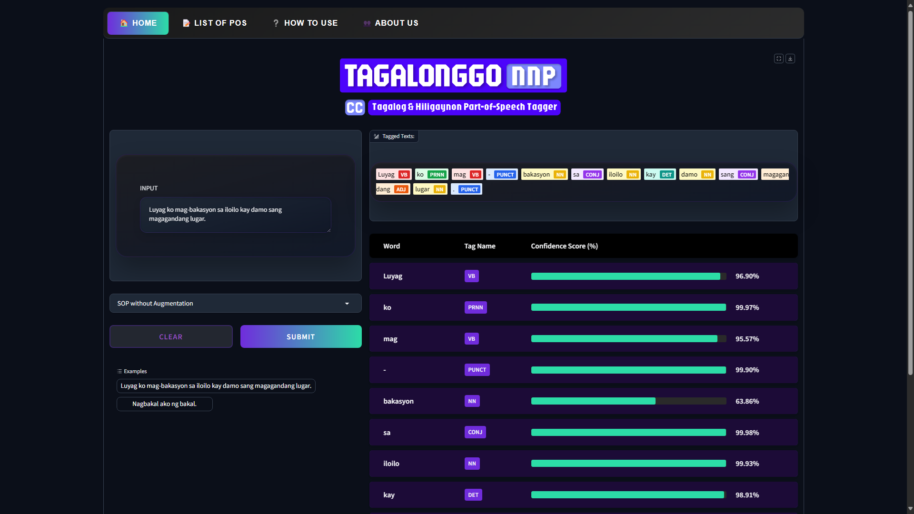

# TAGALONGGO: Tagalog and Ilonggo Part-of-Speech Taggers 🚀

A brief description of your project and its purpose.

---
## Interface Preview


## Prerequisites 📋

- **Python 3.6 or higher**  
  Download and install Python from [python.org](https://www.python.org/downloads/).  
  Verify installation:
  ```bash
  python --version
  # or
  python3 --version
  pip --version
## Installation & Setup 🛠️

1. Clone the Repository
   ```bash
   git clone https://github.com/your-username/your-repo.git
   cd your-repo
2. Create a Python Virtual Environment (Recommended)
- Windows:
   ```bash
   python -m venv venv
   venv\Scripts\activate
- Linux/macOS:
  ```bash
  python3 -m venv venv
  source venv/bin/activate
3. Install Dependencies
   ```bash
   pip install -r requirements.txt

## Running the Program ▶️
-  After activating the virtual environment and installing dependencies, run:
  ```bash
  python app/app.py
